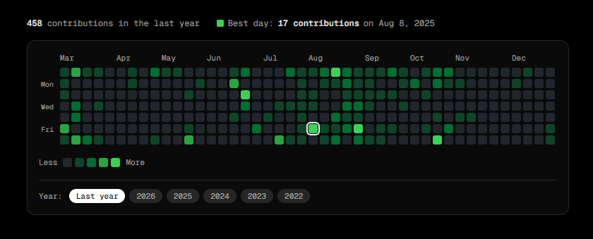

# 📅 github-contributions-ui

A clean, zero-dependency GitHub Contributions Calendar built from scratch with **React** + **TypeScript** + **Tailwind CSS**.

No third-party calendar libraries. Just fetch, compute, and render.



## 📦 Installation

```bash
npm install github-contributions-ui
```

## 🚀 Usage

```tsx
import { GithubActivity } from "github-contributions-ui";

export default function App() {
  return (
    <main>
      <GithubActivity username="your-github-username" theme="dark" />
    </main>
  );
}
```

No API keys. No config. No installs. Just your GitHub username.

## ⚙️ Props

| Prop       | Type     | Required | Description                  |
| ---------- | -------- | -------- | ---------------------------- |
| `username` | `string` | ✅       | Your GitHub username         |
| `theme`    | `string` | ✅       | light / dark / blue / purple |

## 🛠 Tech Stack

- React + TypeScript
- Tailwind CSS
- Next.js (`"use client"`)
- [github-contributions-api](https://github.com/grubersjoe/github-contributions-api) — data source

## 📄 License

MIT License © 2026 Bichitra Behera
